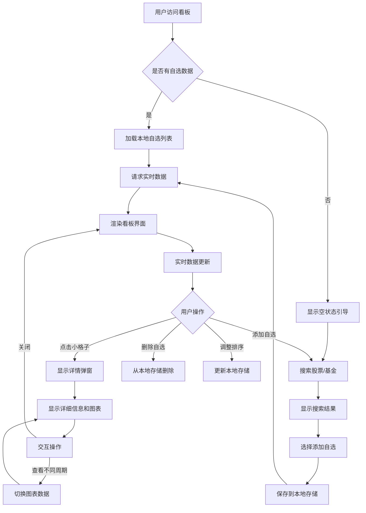
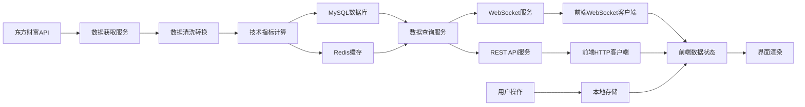
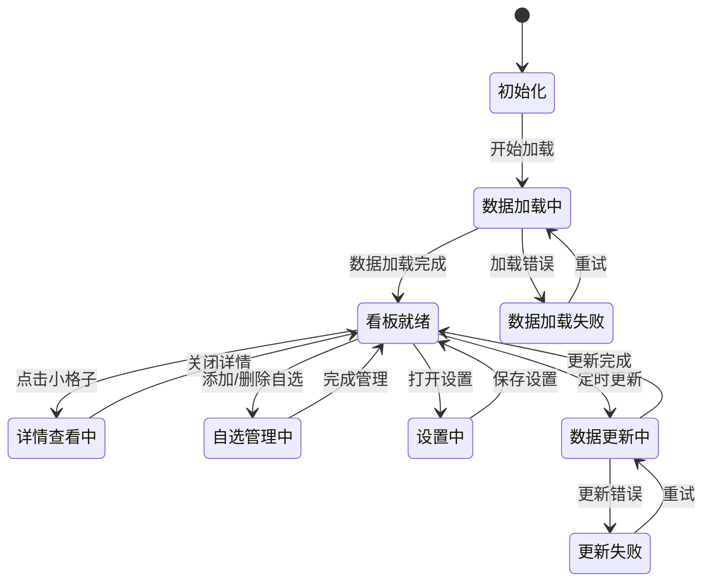

# 股票基金看板需求分析

## 1. 项目概述

### 1.1 项目背景
随着个人投资理财的普及，投资者需要实时了解股票和基金的行情变化。传统的股票软件功能复杂，操作繁琐，而投资者往往只需要关注自己关心的几只股票或基金。因此，需要一个简洁、直观的看板，集中展示自选股票和基金的实时行情。

### 1.2 项目目标
开发一个股票基金看板，让用户能够：
1. 快速查看自选股票和基金的实时行情
2. 直观了解涨跌情况和价格变化
3. 点击查看详细信息和均线图
4. 方便管理自选列表

### 1.3 用户画像
- **主要用户**：个人投资者、股票基金爱好者
- **使用场景**：日常查看行情、投资决策参考
- **技术能力**：基本电脑操作，不需要专业金融知识
- **使用频率**：每日多次，特别是交易时间段

## 2. 功能性需求

### 2.1 核心功能需求

#### 2.1.1 实时行情展示模块
**功能描述**：展示自选股票和基金的实时行情信息

**详细需求**：
1. **看板布局**
   - 大页面显示所有自选项目
   - 每个自选项目显示为一个小格子
   - 支持网格布局，自动排列
   - 响应式设计，适配不同屏幕尺寸

2. **小格子内容**
   - 股票/基金代码和名称
   - 当前价格
   - 涨跌金额和涨跌幅
   - 成交量/成交额（股票）
   - 净值/日增长率（基金）
   - 颜色区分：红色表示上涨，绿色表示下跌

3. **实时更新**
   - 分钟级数据更新
   - 更新时平滑过渡动画
   - 显示最后更新时间

#### 2.1.2 技术分析模块
**功能描述**：提供基础的技术分析功能

**详细需求**：
1. **均线显示**
   - MA5（5日均线）
   - MA10（10日均线）
   - MA20（20日均线）
   - MA30（30日均线）
   - 均线在图表上以不同颜色显示

2. **图表交互**
   - 支持缩放和平移
   - 鼠标悬停显示具体数值
   - 切换不同时间周期（日线、周线）

3. **技术指标**（后续扩展）
   - MACD指标
   - KDJ指标
   - RSI指标
   - 布林带

#### 2.1.3 自选管理模块
**功能描述**：管理用户的自选股票和基金列表

**详细需求**：
1. **添加自选**
   - 通过搜索框搜索股票/基金
   - 显示搜索结果列表
   - 点击添加按钮加入自选
   - 支持批量添加

2. **删除自选**
   - 每个小格子提供删除按钮
   - 支持批量删除
   - 删除前确认提示

3. **排序和分组**
   - 拖拽调整显示顺序
   - 按涨跌幅、价格等排序
   - 分组显示（股票组、基金组）

4. **本地存储**
   - 自选列表保存在浏览器localStorage
   - 支持导出/导入自选列表
   - 多设备间同步（可选）

#### 2.1.4 详情查看模块
**功能描述**：查看单个股票/基金的详细信息

**详细需求**：
1. **详情弹窗**
   - 点击小格子弹出详情窗口
   - 显示更多详细信息
   - 包含均线图表

2. **详细信息**
   - 基础信息：代码、名称、所属板块
   - 实时行情：开盘价、最高价、最低价、昨收价
   - 成交数据：成交量、成交额、换手率
   - 财务指标：市盈率、市净率、市值

3. **图表展示**
   - K线图或折线图
   - 均线叠加显示
   - 成交量柱状图
   - 时间周期切换

#### 2.1.5 系统功能模块
**功能描述**：系统级功能和设置

**详细需求**：
1. **数据源设置**
   - 显示当前数据源状态
   - 手动刷新数据
   - 数据更新频率设置

2. **界面设置**
   - 主题切换（浅色/深色）
   - 字体大小调整
   - 布局密度设置

3. **通知提醒**（后续扩展）
   - 价格预警设置
   - 涨跌幅提醒
   - 系统通知中心

### 2.2 非功能性需求

#### 2.2.1 性能需求
1. **页面加载时间**：首次加载 < 3秒，后续加载 < 1秒
2. **数据更新延迟**：< 60秒（分钟级更新）
3. **响应时间**：用户操作响应 < 100ms
4. **并发支持**：支持100个并发用户

#### 2.2.2 可用性需求
1. **系统可用性**：> 99%
2. **错误率**：< 0.1%
3. **恢复时间**：故障恢复 < 5分钟

#### 2.2.3 兼容性需求
1. **浏览器兼容**：
   - Chrome 90+ ✅
   - Firefox 88+ ✅
   - Edge 90+ ✅
   - Safari 14+ ✅

2. **设备兼容**：
   - 桌面电脑（1920×1080）
   - 笔记本电脑（1366×768）
   - 平板电脑（iPad 1024×768）
   - 手机（iPhone 375×667）

3. **网络兼容**：
   - 宽带网络（> 10Mbps）
   - 4G/5G移动网络
   - 弱网环境降级处理

#### 2.2.4 安全性需求
1. **数据安全**：
   - HTTPS加密传输
   - API密钥安全存储
   - 输入验证和过滤

2. **隐私保护**：
   - 不收集用户个人信息
   - 自选数据本地存储
   - 明确的隐私政策

#### 2.2.5 可维护性需求
1. **代码质量**：
   - 代码注释率 > 20%
   - 单元测试覆盖率 > 70%
   - 遵循编码规范

2. **文档完整性**：
   - 完整的API文档
   - 部署和维护文档
   - 用户使用手册

## 3. 功能模块划分

### 3.1 模块结构图
```
股票基金看板系统
├── 前端展示层
│   ├── 看板页面
│   ├── 详情页面
│   ├── 设置页面
│   └── 公共组件
├── 后端服务层
│   ├── API网关
│   ├── 数据服务
│   ├── WebSocket服务
│   └── 定时任务
├── 数据处理层
│   ├── 数据获取
│   ├── 数据清洗
│   ├── 指标计算
│   └── 数据存储
└── 基础设施层
    ├── 数据库
    ├── 缓存
    ├── 消息队列
    └── 监控系统
```

### 3.2 模块详细说明

#### 3.2.1 前端模块
1. **看板模块（Dashboard）**
   - 主页面布局
   - 小格子组件
   - 网格布局管理
   - 响应式适配

2. **图表模块（Charts）**
   - 均线图表组件
   - K线图表组件
   - 图表交互控制
   - 数据可视化

3. **自选模块（Watchlist）**
   - 自选列表管理
   - 搜索和添加
   - 排序和分组
   - 本地存储

4. **详情模块（Detail）**
   - 详情弹窗
   - 详细信息展示
   - 图表展示
   - 交互控制

5. **设置模块（Settings）**
   - 系统设置
   - 界面设置
   - 数据源设置
   - 用户偏好

#### 3.2.2 后端模块
1. **API服务模块**
   - RESTful API接口
   - 数据查询服务
   - 业务逻辑处理
   - 错误处理

2. **WebSocket模块**
   - 实时连接管理
   - 数据推送服务
   - 心跳检测
   - 连接状态监控

3. **数据服务模块**
   - 东方财富API客户端
   - 数据同步服务
   - 数据清洗转换
   - 缓存管理

4. **计算服务模块**
   - 技术指标计算
   - 均线计算
   - 统计分析
   - 批量处理

#### 3.2.3 数据模块
1. **数据获取模块**
   - API调用封装
   - 定时任务调度
   - 错误重试机制
   - 限流控制

2. **数据存储模块**
   - MySQL数据库设计
   - Redis缓存设计
   - 数据迁移脚本
   - 备份恢复策略

3. **数据处理模块**
   - 数据清洗规则
   - 数据转换逻辑
   - 数据验证检查
   - 数据质量监控

## 4. 业务流程分析

### 4.1 业务流程图



### 4.2 主要业务流程说明

#### 4.2.1 看板浏览流程
1. 用户打开看板页面
2. 系统检查本地是否有自选数据
3. 如果有，加载自选列表并请求实时数据
4. 如果没有，显示空状态和添加引导
5. 渲染看板界面，显示所有自选项目
6. 定时更新实时数据
7. 用户浏览实时行情

#### 4.2.2 自选管理流程
1. 用户点击"添加自选"按钮
2. 弹出搜索框，输入股票/基金代码或名称
3. 系统搜索并显示结果列表
4. 用户选择要添加的项目
5. 系统保存到本地存储
6. 看板立即更新显示新添加的项目

#### 4.2.3 详情查看流程
1. 用户点击某个小格子
2. 弹出详情窗口
3. 显示该股票/基金的详细信息
4. 显示均线图表
5. 用户可以与图表交互（缩放、平移）
6. 可以切换不同的时间周期
7. 关闭窗口返回看板

#### 4.2.4 数据更新流程
1. 定时任务触发数据更新
2. 调用东方财富API获取最新数据
3. 清洗和转换数据
4. 计算技术指标
5. 更新数据库和缓存
6. 通过WebSocket推送数据变更
7. 前端接收数据并更新界面

## 5. 数据流程分析

### 5.1 数据流图



### 5.2 数据流说明

#### 5.2.1 数据流入流程
1. **外部数据源**：东方财富API提供原始数据
2. **数据获取**：定时任务调用API获取数据
3. **数据处理**：清洗、转换、计算指标
4. **数据存储**：保存到MySQL和Redis
5. **数据服务**：通过API和WebSocket提供服务
6. **前端消费**：前端获取数据并展示

#### 5.2.2 数据流出流程
1. **用户操作**：添加、删除、排序自选
2. **本地存储**：操作结果保存到浏览器本地
3. **界面更新**：根据本地数据更新界面
4. **数据请求**：根据需求请求后端数据

#### 5.2.3 数据同步流程
1. **定时同步**：每分钟同步一次实时数据
2. **增量更新**：只同步变化的数据
3. **实时推送**：通过WebSocket推送数据变更
4. **前端更新**：前端接收推送并更新界面

### 5.3 数据实体关系

#### 5.3.1 核心数据实体（在stock-dashboard模块中创建）
1. **看板股票实体（StockDashboardBO）**
   - 基础信息：代码、名称、市场、行业
   - 实时数据：价格、涨跌、成交量
   - 历史数据：K线数据、技术指标
   - 位置：`stock-dashboard/src/main/java/com/spark/stockdashboard/entity/dashboard/`

2. **看板基金实体（FundDashboardBO）**
   - 基础信息：代码、名称、类型、公司
   - 实时数据：净值、日增长率
   - 历史数据：净值历史
   - 位置：`stock-dashboard/src/main/java/com/spark/stockdashboard/entity/dashboard/`

3. **实时价格实体（RealtimePriceBO）**
   - 关联信息：股票/基金代码、类型
   - 价格数据：当前价、涨跌额、涨跌幅
   - 时间信息：更新时间戳
   - 位置：`stock-dashboard/src/main/java/com/spark/stockdashboard/entity/dashboard/`

4. **自选实体（WatchlistItemBO）**
   - 关联信息：股票/基金代码、类型
   - 用户设置：显示顺序、分组
   - 本地存储：浏览器localStorage（前端实体）
   - 位置：前端TypeScript实体类

**重要约束**：
- 不修改现有的`StockBO`和`FundBO`类
- 不修改现有的`StockServiceImpl`服务
- 所有新实体和服务都在stock-dashboard模块中创建

#### 5.3.2 数据关系
```
用户 -- 拥有 --> 自选列表
自选项 -- 关联 --> 股票/基金
股票 -- 包含 --> 历史价格数据
基金 -- 包含 --> 历史净值数据
实时数据 -- 更新 --> 股票/基金
技术指标 -- 计算自 --> 历史数据
```

## 6. 状态流程分析

### 6.1 系统状态图



### 6.2 状态详细说明

#### 6.2.1 系统状态
1. **初始化状态**
   - 系统启动，加载配置
   - 检查本地存储
   - 准备数据连接

2. **数据加载状态**
   - 加载自选列表
   - 请求初始数据
   - 显示加载动画

3. **看板就绪状态**
   - 正常显示看板
   - 实时数据更新
   - 响应用户操作

4. **详情查看状态**
   - 显示详情弹窗
   - 加载详细数据
   - 图表交互

5. **自选管理状态**
   - 添加/删除自选
   - 调整排序
   - 搜索股票/基金

6. **设置状态**
   - 修改系统设置
   - 调整界面偏好
   - 管理数据源

#### 6.2.2 数据状态
1. **数据新鲜度状态**
   - 最新：1分钟内更新
   - 较新：1-5分钟内更新
   - 陈旧：5分钟以上未更新
   - 过期：30分钟以上未更新

2. **连接状态**
   - 已连接：WebSocket连接正常
   - 连接中：正在建立连接
   - 断开：连接已断开
   - 重连中：正在尝试重连

3. **数据源状态**
   - 正常：API响应正常
   - 限流：API调用受限
   - 错误：API调用失败
   - 维护：数据源维护中

### 6.3 状态转换规则

#### 6.3.1 用户操作触发
- 点击小格子：看板就绪 → 详情查看中
- 点击添加按钮：看板就绪 → 自选管理中
- 点击设置按钮：看板就绪 → 设置中
- 关闭弹窗：详情查看中 → 看板就绪

#### 6.3.2 系统事件触发
- 定时更新：看板就绪 → 数据更新中
- 数据加载完成：数据加载中 → 看板就绪
- 连接断开：任何状态 → 连接状态更新
- 数据源异常：数据更新中 → 更新失败

#### 6.3.3 错误处理触发
- 加载失败：数据加载中 → 数据加载失败
- 更新失败：数据更新中 → 更新失败
- 连接错误：任何状态 → 连接状态更新
- 用户重试：失败状态 → 重新尝试

## 7. 界面原型描述

### 7.1 看板主界面

#### 7.1.1 布局结构
```
┌─────────────────────────────────────────────────────┐
│ 头部区域：Logo、标题、最后更新时间、设置按钮        │
├─────────────────────────────────────────────────────┤
│ 主内容区：                                          │
│  ┌─────┐ ┌─────┐ ┌─────┐ ┌─────┐ ┌─────┐         │
│  │股票1│ │股票2│ │股票3│ │基金1│ │基金2│         │
│  │代码 │ │代码 │ │代码 │ │代码 │ │代码 │         │
│  │名称 │ │名称 │ │名称 │ │名称 │ │名称 │         │
│  │价格 │ │价格 │ │价格 │ │净值 │ │净值 │         │
│  │涨跌 │ │涨跌 │ │涨跌 │ │日增 │ │日增 │         │
│  └─────┘ └─────┘ └─────┘ └─────┘ └─────┘         │
│                                                     │
│  ┌─────┐ ┌─────┐ ┌─────┐ ┌─────┐ ┌─────┐         │
│  │股票4│ │股票5│ │股票6│ │基金3│ │基金4│         │
│  │代码 │ │代码 │ │代码 │ │代码 │ │代码 │         │
│  │名称 │ │名称 │ │名称 │ │名称 │ │名称 │         │
│  │价格 │ │价格 │ │价格 │ │净值 │ │净值 │         │
│  │涨跌 │ │涨跌 │ │涨跌 │ │日增 │ │日增 │         │
│  └─────┘ └─────┘ └─────┘ └─────┘ └─────┘         │
├─────────────────────────────────────────────────────┤
│ 底部区域：添加自选按钮、数据源状态、连接状态        │
└─────────────────────────────────────────────────────┘
```

#### 7.1.2 小格子设计
- **尺寸**：200px × 150px（桌面），自适应（移动）
- **背景**：白色/深色背景，根据主题变化
- **边框**：1px浅灰色边框，圆角8px
- **内容布局**：垂直居中，合理间距
- **颜色编码**：红色表示上涨，绿色表示下跌
- **交互效果**：悬停阴影，点击缩放动画

### 7.2 详情弹窗界面

#### 7.2.1 布局结构
```
┌─────────────────────────────────────────────────────┐
│ 头部：股票/基金名称、代码、关闭按钮                 │
├─────────────────────────────────────────────────────┤
│ 标签页：                                            │
│  概况  图表  财务  新闻                            │
├─────────────────────────────────────────────────────┤
│ 内容区：                                            │
│  ┌─────────────────────────────────────────────┐  │
│  │              均线图表                        │  │
│  │  ┌─────────────────────────────────────┐    │  │
│  │  │                                     │    │  │
│  │  │           图表区域                  │    │  │
│  │  │                                     │    │  │
│  │  └─────────────────────────────────────┘    │  │
│  │  周期：日线 周线 月线  指标：MA5 MA10 MA20 │  │
│  └─────────────────────────────────────────────┘  │
│                                                     │
│  ┌─────────────┐ ┌─────────────┐ ┌─────────────┐  │
│  │ 实时行情    │ │ 基础信息    │ │ 成交数据    │  │
│  │ 当前价：    │ │ 市场：      │ │ 成交量：    │  │
│  │ 涨跌额：    │ │ 行业：      │ │ 成交额：    │  │
│  │ 涨跌幅：    │ │ 市值：      │ │ 换手率：    │  │
│  │ 开盘价：    │ │ 市盈率：    │ │ 振幅：      │  │
│  │ 最高价：    │ │ 市净率：    │ │ 量比：      │  │
│  │ 最低价：    │ │ 股息率：    │ │             │  │
│  │ 昨收价：    │ │             │ │             │  │
│  └─────────────┘ └─────────────┘ └─────────────┘  │
└─────────────────────────────────────────────────────┘
```

### 7.3 自选管理界面

#### 7.3.1 搜索添加界面
```
┌─────────────────────────────────────────────────────┐
│ 搜索框：[输入股票/基金代码或名称] [搜索按钮]        │
├─────────────────────────────────────────────────────┤
│ 搜索结果列表：                                       │
│  ┌─────────────────────────────────────────────┐  │
│  │ □ 000001 平安银行 银行板块                  │  │
│  │   当前价：15.32 涨跌幅：+1.25%              │  │
│  │                                           │  │
│  │ □ 000002 万科A  房地产板块                 │  │
│  │   当前价：18.45 涨跌幅：-0.54%              │  │
│  │                                           │  │
│  │ □ 510300 沪深300ETF 指数基金               │  │
│  │   净值：4.256 日增长率：+0.68%              │  │
│  └─────────────────────────────────────────────┘  │
│                                                     │
│  [全选] [添加选中] [取消]                          │
└─────────────────────────────────────────────────────┘
```

## 8. 验收标准

### 8.1 功能验收标准

#### 8.1.1 核心功能验收
1. **看板显示**：能够正确显示所有自选股票和基金
2. **实时更新**：数据能够分钟级更新，显示最新行情
3. **涨跌显示**：正确显示涨跌金额和百分比，颜色正确
4. **详情查看**：点击小格子能够弹出详情窗口
5. **均线图表**：详情中能够显示均线图表
6. **自选管理**：能够添加、删除、排序自选项目
7. **本地存储**：自选列表能够保存在浏览器本地

#### 8.1.2 用户体验验收
1. **加载速度**：页面加载时间符合性能要求
2. **响应速度**：用户操作响应及时
3. **界面美观**：界面设计简洁美观
4. **操作流畅**：交互操作流畅自然
5. **错误处理**：错误情况有友好提示
6. **帮助引导**：新用户有操作引导

### 8.2 技术验收标准

#### 8.2.1 前端验收
1. **代码质量**：代码规范，注释充分
2. **测试覆盖**：单元测试覆盖率达标
3. **性能优化**：页面性能指标达标
4. **兼容性**：主流浏览器兼容测试通过
5. **响应式**：不同设备适配测试通过

#### 8.2.2 后端验收
1. **API设计**：RESTful API设计规范
2. **WebSocket**：实时推送功能正常
3. **数据同步**：数据同步准确及时
4. **错误处理**：系统错误处理完善
5. **性能指标**：系统性能指标达标

#### 8.2.3 数据验收
1. **数据准确性**：显示数据准确无误
2. **数据及时性**：数据更新及时
3. **数据完整性**：必要数据字段完整
4. **数据一致性**：前后端数据一致

### 8.3 文档验收标准

#### 8.3.1 开发文档
1. **设计文档**：数据库设计、API设计完整
2. **部署文档**：部署步骤清晰完整
3. **接口文档**：API接口文档完整
4. **测试文档**：测试用例和报告完整

#### 8.3.2 用户文档
1. **使用手册**：用户操作指南完整
2. **常见问题**：常见问题解答完整
3. **更新日志**：版本更新记录完整

## 9. 风险分析

### 9.1 技术风险
1. **API稳定性风险**：东方财富API可能不稳定或变更
   - 影响：数据获取失败，看板无法更新
   - 应对：实现重试机制，考虑备用数据源

2. **性能风险**：大量小格子同时渲染可能影响性能
   - 影响：页面卡顿，用户体验差
   - 应对：虚拟滚动，分页加载，性能优化

3. **兼容性风险**：不同浏览器兼容性问题
   - 影响：部分用户无法正常使用
   - 应对：充分测试，提供polyfill

### 9.2 项目风险
1. **进度风险**：功能较多，开发周期可能延长
   - 影响：项目延期交付
   - 应对：分阶段开发，优先核心功能

2. **需求变更风险**：用户需求可能变更
   - 影响：开发工作重复或修改
   - 应对：敏捷开发，快速响应

3. **质量风险**：代码质量不达标
   - 影响：系统稳定性差，维护困难
   - 应对：代码审查，测试驱动开发

### 9.3 业务风险
1. **数据准确性风险**：显示数据可能不准确
   - 影响：用户投资决策错误
   - 应对：数据验证，免责声明

2. **法律合规风险**：可能涉及金融数据合规问题
   - 影响：法律风险
   - 应对：咨询法律意见，遵守相关规定

## 10. 附录

### 10.1 术语表
- **股票**：股份有限公司发行的所有权凭证
- **基金**：集合投资计划，由基金管理人管理
- **均线**：移动平均线，反映价格趋势
- **MA5**：5日移动平均线
- **MA10**：10日移动平均线
- **MA20**：20日移动平均线
- **MA30**：30日移动平均线
- **涨跌幅**：当前价格相对于前收盘价的变化百分比
- **成交量**：一定时间内成交的股票数量
- **成交额**：一定时间内成交的金额

### 10.2 参考数据
1. **股票数据字段**：
   - 代码、名称、当前价、涨跌额、涨跌幅
   - 开盘价、最高价、最低价、昨收价
   - 成交量、成交额、换手率、振幅
   - 市盈率、市净率、市值、股息率

2. **基金数据字段**：
   - 代码、名称、类型、管理公司
   - 单位净值、累计净值、日增长率
   - 成立日期、规模、基金经理
   - 申购状态、赎回状态、费率

3. **技术指标**：
   - MA5、MA10、MA20、MA30
   - MACD、KDJ、RSI、布林带
   - 成交量、成交额、换手率

### 10.3 相关规范
1. **前端开发规范**：ESLint配置、代码风格指南
2. **后端开发规范**：Java编码规范、API设计规范
3. **数据库设计规范**：命名规范、索引设计
4. **测试规范**：单元测试规范、集成测试规范
5. **部署规范**：环境配置、发布流程

**结论**：需求分析已完成，明确了功能性需求、非功能性需求、业务流程、数据流程和状态流程。下一步进入设计阶段，完成技术选型、UI设计、数据库设计和API设计。